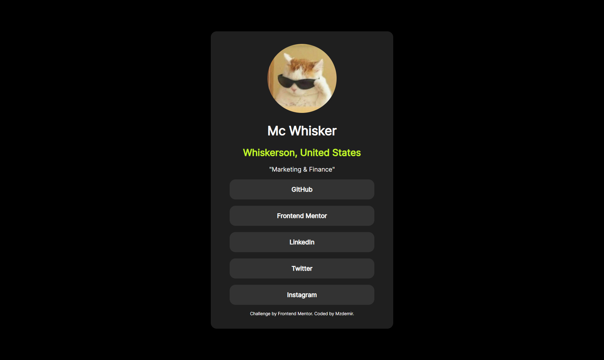

# Frontend Mentor - Recipe page solution

This is a solution to the [Social links profile challenge on Frontend Mentor](https://www.frontendmentor.io/challenges/social-links-profile-UG32l9m6dQ). Frontend Mentor challenges help you improve your coding skills by building realistic projects.

### The challenge

Users should be able to:

- See hover and focus states for all interactive elements on the page

### Screenshots

### Links

- Solution URL: https://www.frontendmentor.io/solutions/mc-whiskers-social-links-page-kDcyt9Clck
- Live Site URL: https://mzdemir-social-links-profile.netlify.app/

### Built with

- Semantic HTML5 markup
- Vanilla CSS

## Author

- Website - https://github.com/mzdemir
- Frontend Mentor - https://www.frontendmentor.io/profile/mzdemir
